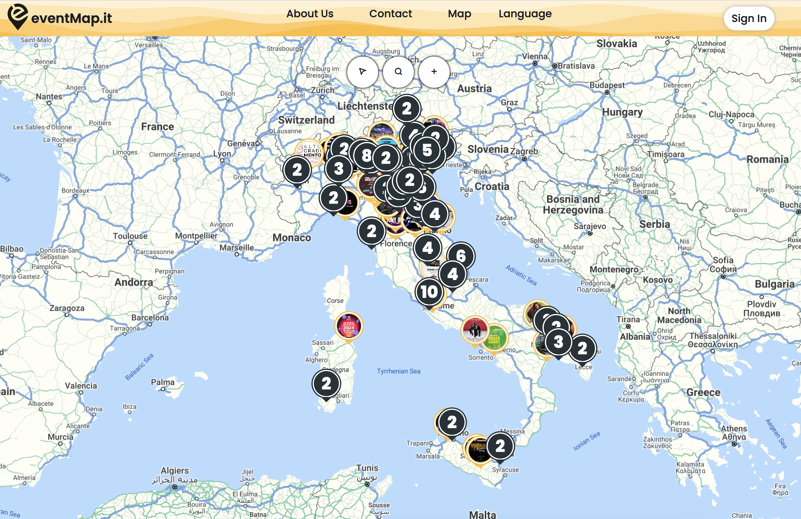
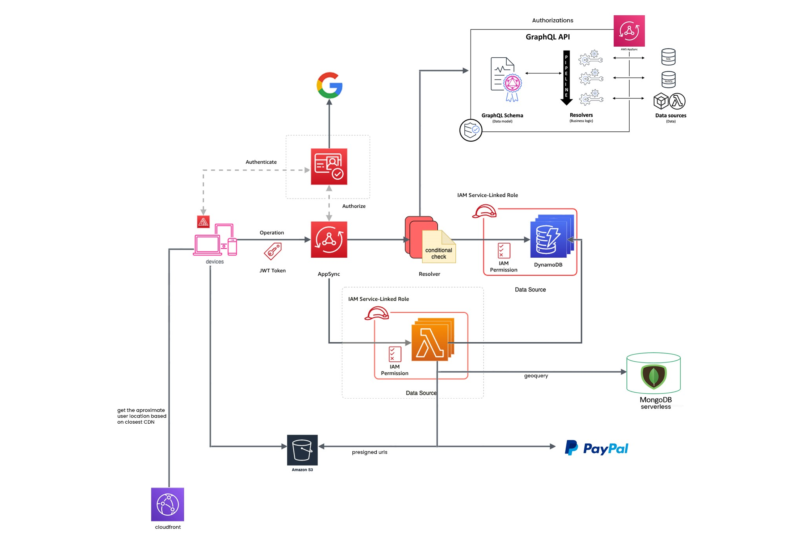
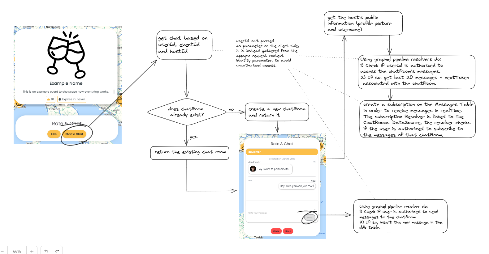
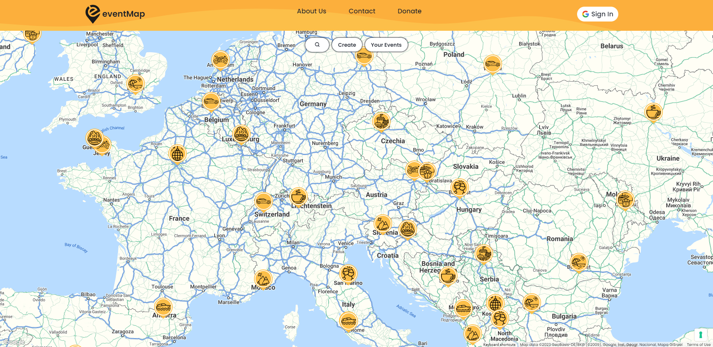
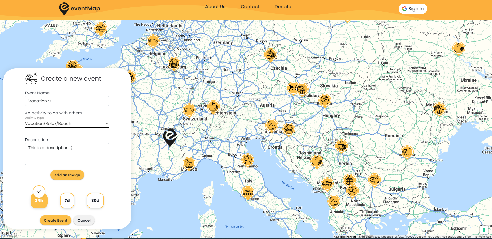
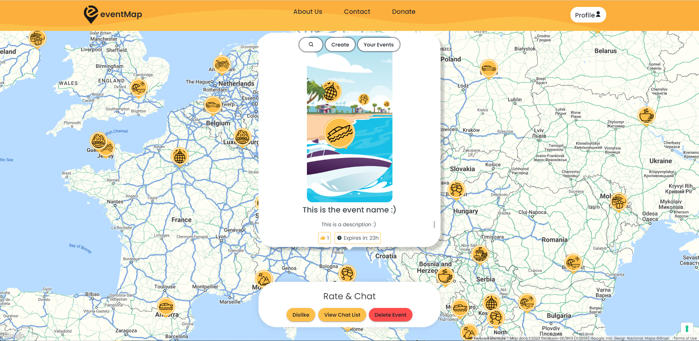
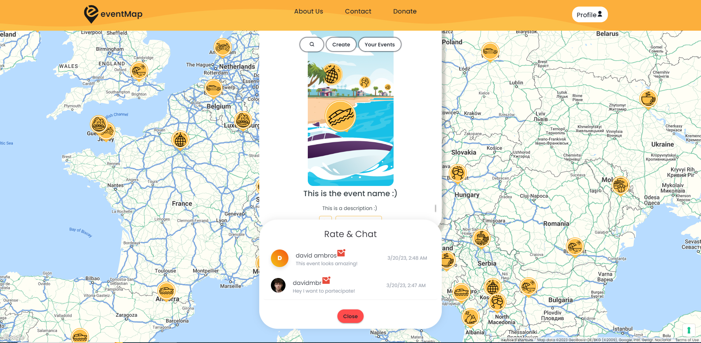
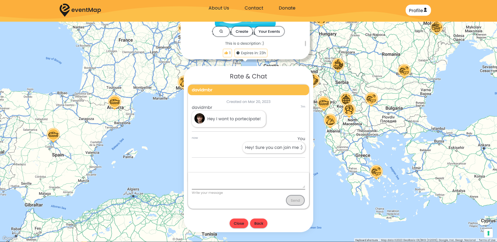

[![LinkedIn][linkedin-shield]][linkedin-url]

<!-- PROJECT LOGO -->

    

  <h1 align="center">EventMap</h1>
  <h3 align="center">www.eventmap.it</h3>
  <h4>
(03/2023) Please note that the project is still in the works, currently in its final dev and testing stage.
The same goes for this repository and documentation.
</h4>

<!-- ABOUT THE PROJECT -->
## About The Project

![Product Name Screen Shot][product-screenshot]

    <a href="#Schema">AWS Infrastructure</a> 

<h1>EventMap</h1>

EventMap is a platform that allows users to create events or sponsor existing public events, providing a general map view of all the events in the area. It also offers a built-in chat system that enables users to communicate and send messages related to each event.

Events expire by default after 24 hours, after which they will be removed from the map. We offer premium plans that allow users to upgrade their accounts, post more events, make them last longer and change the markers' color. These plans can be found in your private area once you Sign in.

The platform only offers one way to authenticate: Google Sign-in. This means that you must have a Google account to create events and access the chat system, and to perform additional actions. 

<h1>AWS Infrastructure</h1>

This project primarily relies on AWS infrastructure, with other APIs and services also utilized, such as Google Maps API, Google OAuth, MongoDB Atlas Serverless, and Paypal.

The purpose of this repository is to showcase a demo of the project's complete architecture and functionality. The entire project was built from scratch by me.

The code for this project is stored in private repositories. For more information on accessing it, please contact me directly.

### Built With

* [Angular](https://angular.io/)
* [AWS CDK V2 in NodeJs](https://docs.aws.amazon.com/cdk/api/v2/)
* [MongoDB Serverless](https://www.mongodb.com/use-cases/serverless)
* [Paypal Developers](https://developer.paypal.com/home)
* [Google Maps API](https://developers.google.com/maps)
* [Iubenda](https://www.iubenda.com/en/)

## Demo

    <h4> AWS Infrastructure schema:</h4>
    
    
This is a little schema about the overall backend infrastructure. There are many AWS services that are being used but not included in this picture, such as AWS secrets manager, cloudfront distributions, route53 domains, VPCs etc.

    
The Angular frontend Appsync APIs are generated using Amplify, that is also used for the CD process.

    
The authentication is made trough cognito federated Identities, users can perform mutation actions only if they are signed-in, appart from some whitelisted mutations, since GDPR wants me to save to DB every user consent of the cookies, even for unauthenticated users.

    
Unfortunatelly a big problem of cognito is that it doesn't redirect you to the account selection screen if you are currently logged into google with only one account, even if you have multiple accounts that are currently on an expired session status, you will not be able to choose which one to use, unless you first sign in into at least 2 google accounts. This is a known cognito issue and there is still no workaround or fix: <a href="https://github.com/aws-amplify/amplify-js/issues/3933">https://github.com/aws-amplify/amplify-js/issues/3933</a> and <a href="https://github.com/aws-amplify/amplify-js/issues/4044">https://github.com/aws-amplify/amplify-js/issues/4044</a> 

    <h4> Chat system:</h4>
    
     
    <h4> The map view:</h4>
    
    
The event fetching works via a MongoDB radius query, the query is made trough an appsync call to a lambda resolver, that connects to a MongoDB Serverless instance.  Before choosing MongoDB I have tried every other option that AWS would offer for geo data management. I first tried to use DDB but the only existing geo-data library is outdated, I have also tried using DocumentDB but that was very expensive, after doing many researches I ended up using MongoDB Serverless that offers a perfect solution since you can create Indexes on Lat-Long data, and query it using radius queries or squared queries.

     
    <h4> The event creation form:</h4>
    
    
Tried to keep it as simple as possible, usually on other websites you would have to go trough a 7-steps form to create an event. The objective is that everyone must be able to create events with just a few clicks

     
    <h4> Once you click on an event you will see:</h4>
    
     
     
    
There are mainly two scenarios

    
1) If you are the host of the event, you will be displayed a list of chats (the users that contacted you).
     2) If you are not the host of the event you will be directly displayed the chat of the clicked event in order to comunicate with the host. 
     
     
    You can see it as a one to many relationship (one event, many chats, hosts can see all the chats related to their events, and a normal user will be able to see only the chat between him and the host)

    
 In the following picture, since I am the host of the event I can see all the people that started a conversation with me

    <h4> All the users that write a message to your event will be displayed as follows (yes I used 3 google accounts to make this demo):</h4>
    
     
    
 Note that the chat system uses backend appsync pipeline resolvers to check who is authorized to access a certain chat.  So no one can access and view/send messages to a chat that doesn't belong to him.   Also, once a chat is oppened, an appsync subscription is started in order to send and receive messages in real time without the need to manually refresh. Also in this case, there is a resolver that checks if you are authorized to create a subscription to the chat

    <h4> Once you select one of the chats that you want to open, you can comunicate with the user who contacted you:</h4>
    
    

 
<h3>Please feel free to discover the website by navigating to www.eventmap.it
  
Documentation WIP </h3>
    
    

(<a href="#top">back to top</a>)

<!-- MARKDOWN LINKS & IMAGES -->
<!-- https://www.markdownguide.org/basic-syntax/#reference-style-links -->
[linkedin-shield]: https://img.shields.io/badge/-LinkedIn-black.svg?style=for-the-badge&logo=linkedin&colorB=555
[linkedin-url]: https://www.linkedin.com/in/david-ambros-07404a174/
[product-screenshot]: imgs/main_bg.png
